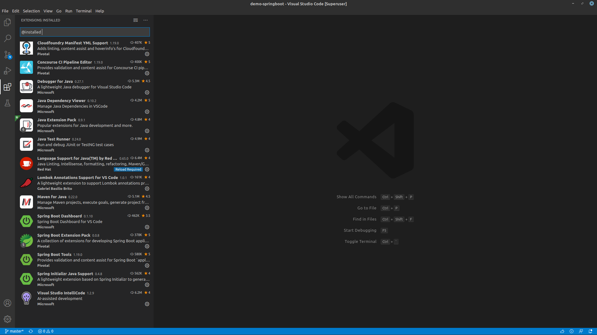
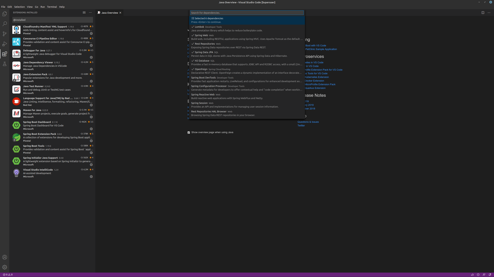

# VS Code 기반의 개발환경 구성

- 목표 : Microsoft사의 Visual Studio Code 기반의 개발환경 구성 및 사용법을 위한 Springboot기반의 Sample Application 개발

## 0. 사전환경

- 로컬개발환경에 jdk 및 gradle이 설치 되어있다.

## 1. 개발환경 구성 : VSCode Plugin 설치(<https://code.visualstudio.com/docs/java/java-spring-boot>)

### 1.1 Plugins



- 아래 Plugin 설치시 의존성이 있는 여러 Plugin이 함께 설치 된다.
  - Java Extension Pack
  - Spring Boot Tools
  - Spring Initializr Java Support
  - Lombok
  - docs-yml
  - YAML

## 2. Springboot 프로젝트 생성

1. F1을 눌러 Command Palette 실행
2. gradle을 검색 'Spring initializer' 를 선택
3. Language : java 선택
4. Group Id : me.potato.demo 입력
5. Artifact Id: demo-springboot 입력
6. 사용할 의존성 선택 : Lombok, Spring Web, Rest Repository, H2, JPA, OpenFeign



## 3. Model 생성

### 3.1 Sample Entity 생성

```java
package me.potato.demo.demospringboot.sample;

import javax.persistence.Entity;
import javax.persistence.GeneratedValue;
import javax.persistence.Id;

import lombok.AllArgsConstructor;
import lombok.Builder;
import lombok.Getter;
import lombok.NoArgsConstructor;
import lombok.Setter;

@Getter
@Setter
@AllArgsConstructor
@NoArgsConstructor
@Builder
@Entity
public class Sample {
    @Id
    @GeneratedValue
    private Long id;
    private String data;
}
```

### 3.2 SampleRepository 생성

Restful API를 expose하기 위해서 @RestResource Annotation을 추가한다.

```java
package me.potato.demo.demospringboot.sample;

import org.springframework.data.repository.PagingAndSortingRepository;
import org.springframework.data.rest.core.annotation.RestResource;

@RestResource
public interface SampleRepository extends PagingAndSortingRepository<Sample, Long> {}
```

### 4. SampleClient 작성

네트워크를 통해 호출하기 위한 FegnClien 기반의 SampleClient를 작성한다.  
(url에 설정된 주소를 통해 호출된다.)

```java
package me.potato.demo.demospringboot.sample.client;

import org.springframework.cloud.openfeign.FeignClient;
import org.springframework.data.domain.Pageable;
import org.springframework.hateoas.CollectionModel;
import org.springframework.web.bind.annotation.GetMapping;
import org.springframework.web.bind.annotation.PostMapping;
import org.springframework.web.bind.annotation.RequestBody;

import me.potato.demo.demospringboot.sample.Sample;

@FeignClient(name="samples", url="http://localhost:8080", path="samples")
public interface SampleClient {

    @GetMapping
    CollectionModel<Sample> getSamples(Pageable pageable);

    @PostMapping
    void createSample(@RequestBody Sample sample);
}
```

### 5. JUnit Test 작성

```java
package me.potato.demo.demospringboot;

import static org.junit.jupiter.api.Assertions.assertSame;

import org.junit.jupiter.api.Test;
import org.springframework.beans.factory.annotation.Autowired;
import org.springframework.boot.test.context.SpringBootTest;
import org.springframework.boot.test.context.SpringBootTest.WebEnvironment;
import org.springframework.data.domain.Pageable;
import org.springframework.hateoas.CollectionModel;

import me.potato.demo.demospringboot.sample.Sample;
import me.potato.demo.demospringboot.sample.SampleRepository;
import me.potato.demo.demospringboot.sample.client.SampleClient;

@SpringBootTest(webEnvironment = WebEnvironment.DEFINED_PORT)
class DemoApplicationTests {

    @Autowired
    SampleRepository sampleRepository;

    @Autowired
    SampleClient sampleClient;

    @Test
    void contextLoads() {
    }

    @Test
    void createSamples() {
        sampleRepository.deleteAll();
        sampleRepository.save(Sample.builder().data("data01").build());
        sampleRepository.save(Sample.builder().data("data02").build());
        sampleRepository.save(Sample.builder().data("data02").build());

        long count = sampleRepository.count();
        assertSame(3l, count);

    }

    @Test
    void createSamplesByNetwork() {
        sampleRepository.deleteAll();

        sampleClient.createSample(Sample.builder().data("data01").build());
        sampleClient.createSample(Sample.builder().data("data02").build());
        sampleClient.createSample(Sample.builder().data("data03").build());

        long count = sampleRepository.count();
        assertSame(3l, count);

        CollectionModel<Sample> samples = sampleClient.getSamples(Pageable.unpaged());
        assertSame(3, samples.getContent().size());

    }

}

```

### 6. 구동

1. 'F5' 키를 눌러 실제 구동을 할 수 있다.

### 7. VS Code 좌측 메뉴 설명

1. Explorer : 프로젝트 워크스페이스의 파일들을 탐색할 수 있다.
2. Search : 머... 워크스페이스 내의 검색이다.
3. Source Control: git이다. 보통 변경 내역 git status 내역을 보여주며, quick commit 할 수 있다.
4. Run : 실행 또는 Debug 용도의 layout이다.
5. Test : 단위테스트 코드를 위한 layout이다.